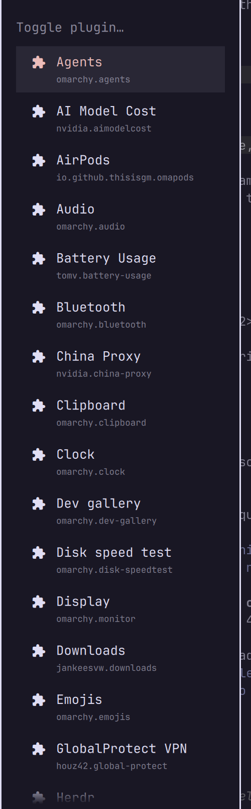

# omarchy-plugin-switcher

An [Omarchy](https://omarchy.org/) shell plugin that lets you reach any
enabled plugin panel by name — no per-plugin hotkey needed.

## Why

Toggling a specific plugin panel from a keybinding normally means that
plugin has to expose its own IPC verb, and you have to memorize (or bind) a
separate key per plugin. This adds a single bar icon (and IPC target) that
fuzzy-searches every enabled panel-capable plugin by name and toggles
whichever one you pick — the same `shell.toggle` call a plugin's own bar
icon makes, just addressed by name instead of a specific icon.



It's a fully standalone plugin — it doesn't touch, clone, or replace any
other plugin. Install it and a new icon shows up next to the existing ones.

## Install

```sh
omarchy plugin add https://github.com/houz42/omarchy-plugin-switcher.git --enable
```

## Use

- Click the bar icon, or run `omarchy-shell shell toggle houz42.plugin-switcher`.
- A native fuzzy list of every enabled panel-capable plugin (`bar-widget`,
  `panel`, `overlay`, `menu` kinds) pops up. Type a few letters of the name,
  hit Enter, and that plugin's panel opens (or closes, if it was already
  open).

## Keybinding (Hyprland / Omarchy)

Add to `~/.config/hypr/bindings.lua`:

```lua
o.bind("SUPER + ALT + P", "Plugin Switcher", "omarchy-shell shell toggle houz42.plugin-switcher")
```

## How it works

The bar icon has no popup of its own — clicking it (or toggling it via IPC)
runs `bin/omarchy-toggle-plugin`, which lists every enabled plugin via
`omarchy-plugin-list --json`, hands the names to Omarchy's native picker
(`omarchy-menu-select`, the same list widget "Enable/Disable Plugin" uses),
and forwards the selection to `omarchy-shell shell toggle <id>`.

## Known limitations

- Only lists plugins whose `kinds` include `bar-widget`, `panel`, `overlay`,
  or `menu` — plugins that are purely `service` kind have no panel to
  toggle and are excluded.
- Uses Omarchy's internal shell components (`qs.Ui` / `qs.Commons`), which
  aren't a documented stable plugin API and could change without notice.

## License

MIT
